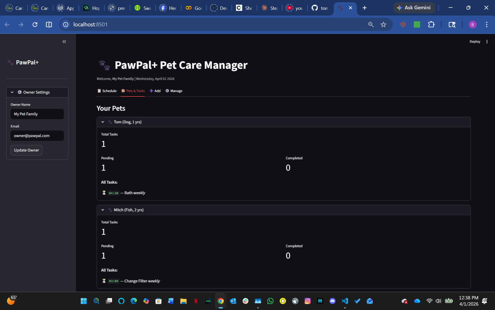

<!-- # PawPal+ (Module 2 Project)

You are building **PawPal+**, a Streamlit app that helps a pet owner plan care tasks for their pet.

## Scenario

A busy pet owner needs help staying consistent with pet care. They want an assistant that can:

- Track pet care tasks (walks, feeding, meds, enrichment, grooming, etc.)
- Consider constraints (time available, priority, owner preferences)
- Produce a daily plan and explain why it chose that plan

Your job is to design the system first (UML), then implement the logic in Python, then connect it to the Streamlit UI.

## What you will build

Your final app should:

- Let a user enter basic owner + pet info
- Let a user add/edit tasks (duration + priority at minimum)
- Generate a daily schedule/plan based on constraints and priorities
- Display the plan clearly (and ideally explain the reasoning)
- Include tests for the most important scheduling behaviors

## Getting started

### Setup

```bash
python -m venv .venv
source .venv/bin/activate  # Windows: .venv\Scripts\activate
pip install -r requirements.txt
```

### Suggested workflow

1. Read the scenario carefully and identify requirements and edge cases.
2. Draft a UML diagram (classes, attributes, methods, relationships).
3. Convert UML into Python class stubs (no logic yet).
4. Implement scheduling logic in small increments.
5. Add tests to verify key behaviors.
6. Connect your logic to the Streamlit UI in `app.py`.
7. Refine UML so it matches what you actually built.

### Smarter Scheduling

- **Sorting by Time** — All tasks are automatically sorted chronologically using Python's `sorted()` with a lambda key on the `HH:MM` time string.
- **Filtering** — Filter the task list by pet name, completion status (pending/complete), or both simultaneously.
- **Conflict Detection** — The Scheduler scans all pending tasks for exact time/date overlaps and surfaces clear warning messages rather than crashing.
- **Recurring Tasks** — Marking a `daily` task complete automatically generates a new task for tomorrow; `weekly` tasks reschedule 7 days out using Python's `timedelta`. -->

# 🐾 PawPal+ — Smart Pet Care Manager

PawPal+ is a smart pet care management system that helps owners keep their pets
happy and healthy by tracking daily routines — feedings, walks, medications, and
appointments — using algorithmic logic to organize and prioritize tasks.

---

## 🚀 Getting Started

### Prerequisites

```bash
pip install streamlit pytest
```

### Run the App

```bash
streamlit run app.py
```

### Run the CLI Demo

```bash
python main.py
```

---

## 🎯 Features

### Core

- **Owner & Pet Management** — Create an owner, add multiple pets (dog, cat, bird, etc.), and remove them at any time.
- **Task Scheduling** — Schedule any care activity with a description, time, frequency, and due date.

### Smarter Scheduling

- **Sorting by Time** — All tasks are automatically sorted chronologically using Python's `sorted()` with a lambda key on the `HH:MM` time string.
- **Filtering** — Filter the task list by pet name, completion status (pending/complete), or both simultaneously.
- **Conflict Detection** — The Scheduler scans all pending tasks for exact time/date overlaps and surfaces clear warning messages rather than crashing.
- **Recurring Tasks** — Marking a `daily` task complete automatically generates a new task for tomorrow; `weekly` tasks reschedule 7 days out using Python's `timedelta`.

---

## 📐 Architecture

### Classes

| Class       | Responsibility                                                                                                                                       |
| ----------- | ---------------------------------------------------------------------------------------------------------------------------------------------------- |
| `Task`      | Holds a single care activity: description, time, frequency, completion status, and due date. Handles its own recurrence logic via `mark_complete()`. |
| `Pet`       | Stores pet details and a list of Tasks. Provides add/remove/filter helpers.                                                                          |
| `Owner`     | Manages a collection of Pets. Aggregates all tasks across pets.                                                                                      |
| `Scheduler` | The "brain". Receives an Owner and provides sort, filter, conflict detection, and recurrence handling.                                               |

---

## 📸 Demo



---

## 🧪 Testing PawPal+

Run the full automated test suite with:

```bash
python -m pytest
```

### What the tests cover

- Task completion changes `is_complete` to `True`
- Daily task recurrence creates a task scheduled for tomorrow
- Weekly task recurrence creates a task scheduled 7 days out
- One-time tasks return `None` on completion (no follow-up)
- Adding a task increases a pet's task count
- Removing a task decreases a pet's task count
- `get_pending_tasks()` correctly excludes completed tasks
- `sort_by_time()` returns tasks in chronological order
- `filter_tasks()` correctly narrows by pet and status
- `detect_conflicts()` flags duplicate time slots
- `detect_conflicts()` returns no warnings when there are none
- Empty pet list doesn't cause exceptions

**Confidence Level: ⭐⭐⭐⭐☆ (4/5)**
All core behaviors are verified. Confidence would reach 5/5 with additional edge-case coverage for overlapping time windows (not just exact matches).

---

## 📁 File Structure

```
pawpal/
├── pawpal_system.py   # Logic layer — Owner, Pet, Task, Scheduler
├── app.py             # Streamlit UI
├── main.py            # CLI demo script
├── uml_final.png      # Final UML diagram
├── reflection.md      # Design and AI collaboration reflection
├── tests/
│   └── test_pawpal.py # Automated pytest suite
└── README.md
```
