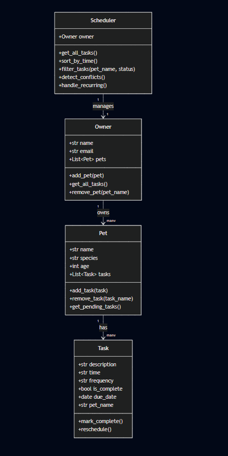

# PawPal+ Project Reflection

## 1. System Design

**a. Initial design**

A user must be able to:

1. **Add a pet** — Register a pet by name, species, and age under an owner profile.
2. **Schedule a task** — Assign a care activity (walk, feed, medication, appointment) to a specific pet with a time, date, and frequency.
3. **View today's tasks** — See all tasks for the day, sorted by time, with any scheduling conflicts flagged.

### Classes

- **`Task`** — The atomic unit. Each task holds a description, time, frequency, completion status, and due date.
- **`Pet`** — An intermediate container. It owns a list of `Task` objects and provides helper methods for adding, removing, and filtering tasks.
- **`Owner`** — The top-level entity. An Owner owns a list of `Pet` objects and aggregates all tasks across them. This is the single source of truth for the entire system.
- **`Scheduler`** — The a non-dataclass, because it holds _behavior_, not data. It receives an `Owner` instance and acts as the engine for sorting, filtering, conflict detection, and recurrence.

**b. Design changes**

When I asked Copilot to review my initial skeleton, it flagged two things:

1. **Missing `pet_name` on Task** — My first draft had Tasks that only knew their description and time. Copilot pointed out that once a Scheduler aggregates tasks from multiple pets, you lose track of which pet each task belongs to. I added a `pet_name: str` field to `Task` to solve this.

2. **`Scheduler` should receive `Owner`, not a list of pets directly** — My first instinct was to pass `Scheduler` a flat list of pets. Copilot suggested passing the whole `Owner` so the Scheduler has access to owner-level context (e.g., the owner's name for display).

- Did your design change during implementation?
- If yes, describe at least one change and why you made it.

---

## 2. Scheduling Logic and Tradeoffs

**a. Constraints and priorities**

- What constraints does your scheduler consider (for example: time, priority, preferences)?
- How did you decide which constraints mattered most?

**b. Tradeoffs**

- Describe one tradeoff your scheduler makes.
- Why is that tradeoff reasonable for this scenario?

---

## 3. AI Collaboration

**a. How you used AI**

- How did you use AI tools during this project (for example: design brainstorming, debugging, refactoring)?
- What kinds of prompts or questions were most helpful?

**b. Judgment and verification**

- Describe one moment where you did not accept an AI suggestion as-is.
- How did you evaluate or verify what the AI suggested?

---

## 4. Testing and Verification

**a. What you tested**

- What behaviors did you test?
- Why were these tests important?

**b. Confidence**

- How confident are you that your scheduler works correctly?
- What edge cases would you test next if you had more time?

---

## 5. Reflection

**a. What went well**

- What part of this project are you most satisfied with?

**b. What you would improve**

- If you had another iteration, what would you improve or redesign?

**c. Key takeaway**

- What is one important thing you learned about designing systems or working with AI on this project?
